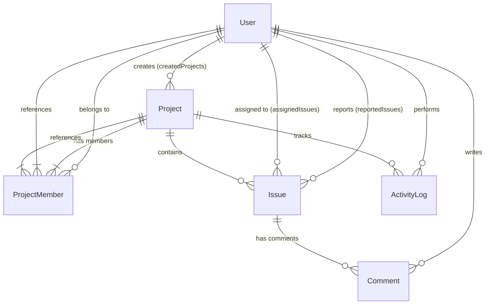

# TrackFlow 🚀

> **"A lightweight issue tracking and project intelligence platform for small development teams."**

TrackFlow delivers a streamlined, developer-first issue tracking experience paired with an automated **Project Intelligence Dashboard**. It eliminates the complexity and bloat of legacy enterprise tools (like Jira) while providing the team collaboration, role-based security, Kanban workflow, and delivery analytics needed to ship software on schedule.

---

## 🌟 Key Highlights & Signature Features

### 1. Project Intelligence Dashboard (Signature Feature)
- **Live Delivery Metrics:** Instant calculation of total issues, active/completed tasks, completion percentage, and overdue tasks.
- **Average Resolution Time:** Automatically tracks cycle time from issue creation to `DONE` state in hours.
- **Team Workload Distribution:** Visualizes open vs completed issue allocations per project member, preventing team burnout.
- **Status & Priority Distribution:** Real-time interactive charts (Recharts) detailing distribution across `TODO`, `IN_PROGRESS`, and `DONE` as well as `CRITICAL`, `HIGH`, `MEDIUM`, `LOW`.
- **Chronological Audit Trail:** Recent project activities streamed live with user attribution.

### 2. Kanban Board & Visual Workflows
- Interactive 3-column Kanban board (`To Do`, `In Progress`, `Done`) with instant status transitions.
- Filter board cards by priority, keyword search, or assignee.
- Quick issue creation directly from column headers.

### 3. Granular Role-Based Access Control (RBAC)
- **`OWNER`:** Full workspace management, project settings, member role administration, and project deletion.
- **`ADMIN`:** Project administration, issue deletion, member invites, and attribute management.
- **`MEMBER`:** Task creation, self-assignment, status updates, comments, and board participation.

### 4. Comprehensive Issue Management
- **Labels & Tags:** Categorize issues (`#frontend`, `#backend`, `#security`, etc.) for instant cross-filtering.
- **Due Dates & Overdue Alerts:** Visual indicators and dashboard warnings for pending deadlines.
- **Member Assignment:** Assign and reassign tasks directly to project collaborators.
- **Issue Comments & History:** Markdown-styled discussion threads with author edit/delete permissions.
- **Global & Project-Scoped Views:** Dedicated project issue lists alongside workspace-wide issue navigator.

---

## 🛠️ Technology Stack

| Layer | Technologies Used |
|---|---|
| **Frontend** | React 19, Vite, React Router v7, TanStack Query v5, React Hook Form, Zod, Tailwind CSS v4, Lucide React, Recharts, shadcn/ui |
| **Backend** | Node.js, Express 5, Prisma ORM, PostgreSQL |
| **Authentication & Security** | JSON Web Tokens (JWT), bcrypt (10 rounds), Cookie-Parser, Helmet-style security headers, in-memory rate limiting, CORS |
| **Database** | Neon Serverless PostgreSQL |
| **Testing** | Node.js Native Test Runner (`node:test`, `node:assert`) |

---

## 🏛️ System Architecture

```
┌────────────────────────────────────────────────────────────────────────┐
│                        React 19 SPA Frontend                           │
│  (Vite + React Router v7 + TanStack Query v5 + Tailwind CSS + Recharts) │
└───────────────────────────────────┬────────────────────────────────────┘
                                    │ HTTP REST API (JSON)
                                    │ Cookies + Bearer Token Fallback
┌───────────────────────────────────▼────────────────────────────────────┐
│                         Express.js Backend API                         │
│  ┌─────────────────────────┐   ┌────────────────────────────────────┐  │
│  │ Security & Middlewares  │──►│ Route Gateway (/api/*)             │  │
│  │ (CORS, Rate Limiting,   │   │  - /auth                           │  │
│  │  Auth Verification)     │   │  - /projects                       │  │
│  └─────────────────────────┘   │  - /issues                         │  │
│                                │  - /comments                       │  │
│                                │  - /dashboard                      │  │
│                                │  - /activity                       │  │
│                                └─────────────────┬──────────────────┘  │
│                                                  │                     │
│                                ┌─────────────────▼──────────────────┐  │
│                                │ Controllers (Zod Input Validation) │  │
│                                └─────────────────┬──────────────────┘  │
│                                                  │                     │
│                                ┌─────────────────▼──────────────────┐  │
│                                │ Services (Business & RBAC Logic)   │  │
│                                └─────────────────┬──────────────────┘  │
│                                                  │                     │
│                                ┌─────────────────▼──────────────────┐  │
│                                │ Prisma ORM ($transaction & Client) │  │
│                                └─────────────────┬──────────────────┘  │
└──────────────────────────────────────────────────┼─────────────────────┘
                                                   │ SQL Connection Pool
┌──────────────────────────────────────────────────▼─────────────────────┐
│                       Neon PostgreSQL Database                         │
│   (Users, Projects, ProjectMembers, Issues, Comments, ActivityLogs)    │
└────────────────────────────────────────────────────────────────────────┘
```

---

## 🗄️ Database Entity Relationship Diagram (ERD)



---

## 🚀 Quickstart & Local Setup

### Prerequisites
- Node.js (v18+ or v20+)
- PostgreSQL connection string (e.g. Neon, Supabase, or local Postgres)

### 1. Clone & Install Dependencies

```bash
# Clone the repository
git clone https://github.com/ritesh0w0/TrackFlow.git
cd TrackFlow

# Install Server dependencies
cd server
npm install

# Install Client dependencies
cd ../client
npm install
```

### 2. Configure Environment Variables

**Server Environment (`server/.env`):**
```env
PORT=3000
DATABASE_URL="postgresql://<user>:<password>@<host>/<database>?sslmode=require"
JWT_SECRET="your_secure_random_jwt_secret_key"
CLIENT_URL="http://localhost:5173"
NODE_ENV="development"
```

**Client Environment (`client/.env`):**
```env
VITE_API_URL="http://localhost:3000/api"
```

### 3. Initialize Database & Migrations

```bash
cd server
npx prisma generate
npx prisma db push
```

### 4. Run the Application Locally

**Terminal 1 (Backend API):**
```bash
cd server
npm run dev
# Server runs on http://localhost:3000
```

**Terminal 2 (Frontend Client):**
```bash
cd client
npm run dev
# Client runs on http://127.0.0.1:5173
```

---

## 🧪 Automated Testing

TrackFlow includes a zero-dependency automated integration test suite utilizing Node.js native test runner:

```bash
cd server
npm test
```

**Test Suite Coverage:**
- `AUTH`: Signup validation, duplicate rejection, login verification, `/auth/me` session recovery, logout.
- `PROJECT`: Project creation, OWNER privilege assignment, project isolation.
- `MEMBERS`: Collaborator onboarding, role assignment (`ADMIN`/`MEMBER`), member removal.
- `ISSUES`: Issue creation with tags, priority validation, `resolvedAt` calculation on status changes, assignee linking.
- `COMMENTS`: Issue discussion thread creation, editing, author authorization.
- `DASHBOARD`: Intelligence metrics computation, completion rate calculation, workload distribution aggregation.
- `ACTIVITY`: Unified project timeline generation.

---

## 🔒 Security & Engineering Best Practices

1. **Strict Server-Side Boundary:** Client-submitted `userId` claims are ignored; identity is securely derived from verified JWT tokens.
2. **ACID Transactions:** Prisma `$transaction` guarantees atomicity across entity mutations and activity log recordings.
3. **Password Security:** Salted hashes generated with `bcrypt` (10 rounds); credentials are never logged or returned in responses.
4. **Resilient Dual-Auth Strategy:** HTTP-only cookies paired with Bearer token authorization header fallbacks to ensure compatibility across modern partitioned cookie environments.
5. **No N+1 Query Bottlenecks:** Dashboard analytics dispatches parallel queries via `Promise.all()` with database-level aggregations (`groupBy`, `count`).
6. **Input Sanitization & Validation:** Comprehensive Zod schemas on both frontend forms and backend controllers.

---

## 📦 Deployment Architecture

- **Frontend:** Vercel / Netlify (`dist` output from `vite build`).
- **Backend API:** Render / Railway (`node src/server.js`).
- **Database:** Neon Serverless PostgreSQL with connection pooling.

---

## 📄 Documentation Directory

- [AI Implementation Log](file:///c:/trackflow/docs/AI_IMPLEMENTATION_LOG.md)
- [System Architecture Specification](file:///c:/trackflow/docs/ARCHITECTURE.md)
- [REST API Reference](file:///c:/trackflow/docs/API.md)
- [Database Schema & ERD](file:///c:/trackflow/docs/ERD.md)
- [Technical Interview Guide & 20+ Q&As](file:///c:/trackflow/docs/INTERVIEW_GUIDE.md)
- [QA Checklist & Test Results](file:///c:/trackflow/docs/QA_CHECKLIST.md)

---

## 📜 License
ISC License © 2026 TrackFlow Team.
