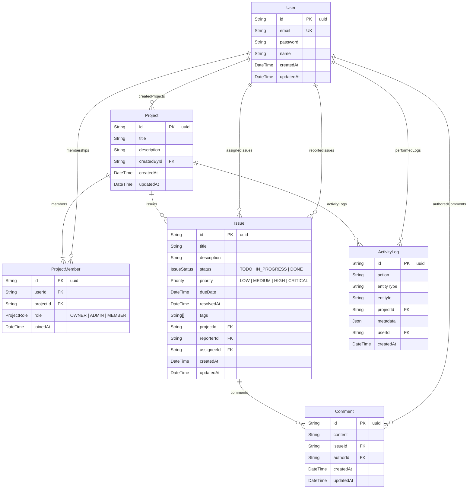

# TrackFlow Database Schema & ERD

## 1. Entity Relationship Diagram



---

## 2. Enums

### `ProjectRole`
- `OWNER`: Creator or root administrator with full privileges.
- `ADMIN`: Project manager with collaborator and issue administration rights.
- `MEMBER`: Standard team collaborator.

### `IssueStatus`
- `TODO`: Pending backlog task.
- `IN_PROGRESS`: Actively underway.
- `DONE`: Completed / Resolved.

### `Priority`
- `LOW`: Low severity / nice-to-have.
- `MEDIUM`: Standard sprint task.
- `HIGH`: Major feature or blocking bug.
- `CRITICAL`: Urgent blocker or security vulnerability.

---

## 3. Database Indexes & Performance Optimizations

```prisma
// Issue composite indexes for high-frequency dashboard and filtering queries:
@@index([projectId, status])
@@index([projectId, priority])
@@index([projectId, createdAt])

// ActivityLog indexes for fast timeline retrieval:
@@index([projectId])
@@index([createdAt])

// ProjectMember composite uniqueness constraint:
@@unique([userId, projectId])
```
